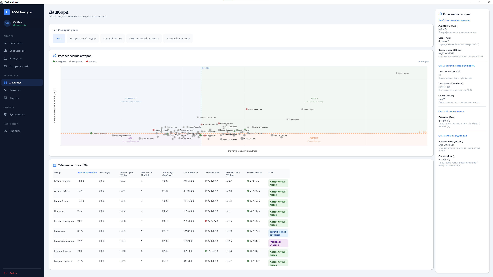
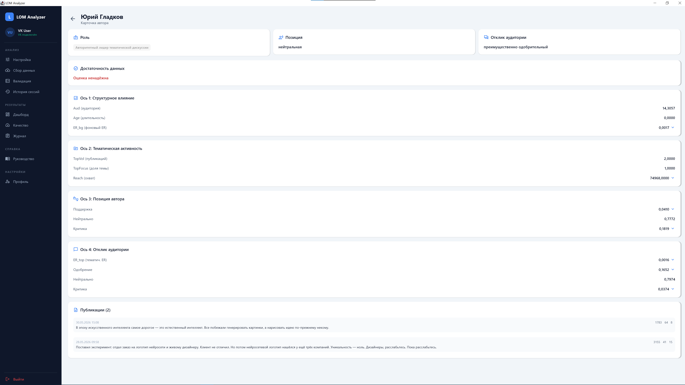
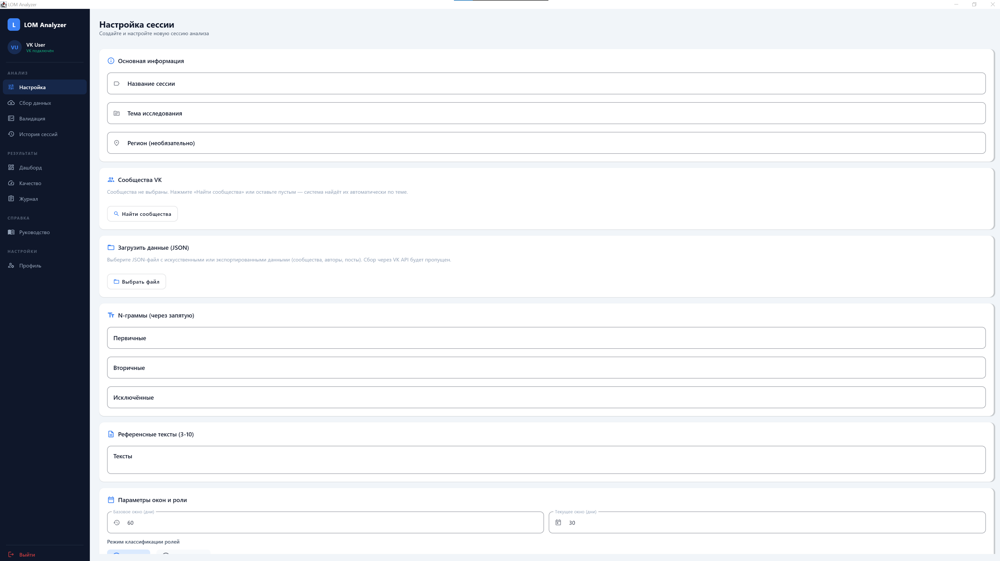
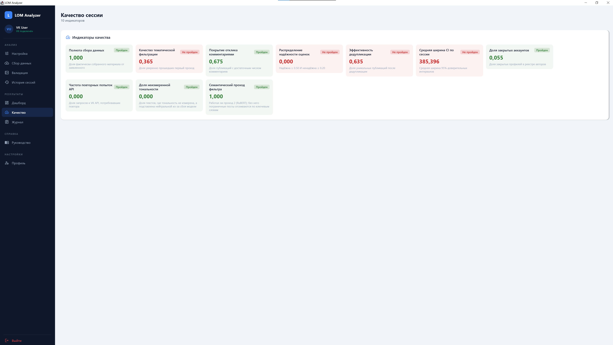
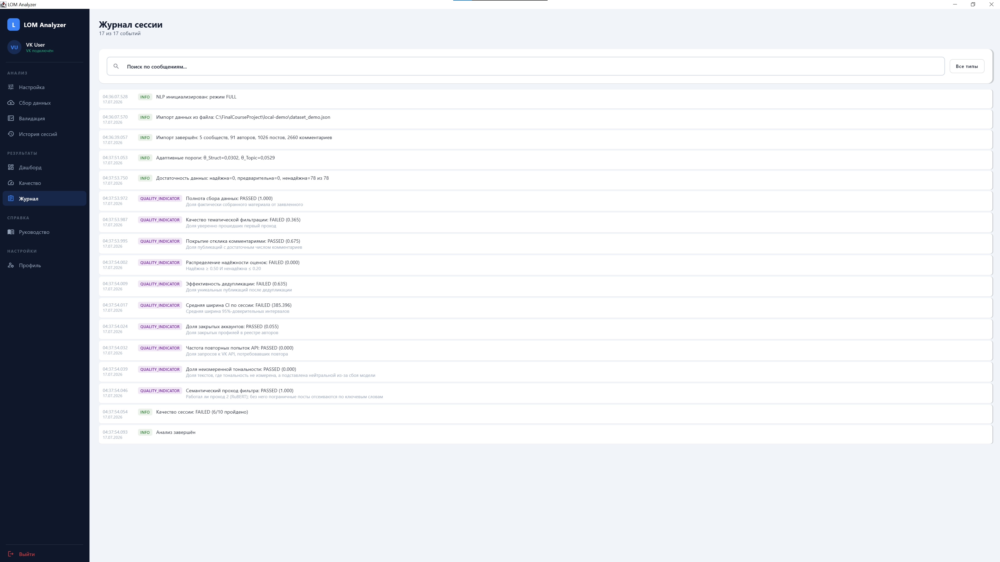

# LOM Analyzer

[](https://github.com/NikkiWay/lom-analyzer/actions/workflows/build.yml)
[](LICENSE)
[](https://kotlinlang.org)
[](https://adoptium.net)

**Десктопное приложение для количественной идентификации лидеров общественного мнения (ЛОМ) во ВКонтакте.**

Приложение собирает публикации по заданной теме, определяет авторов, участвующих в её обсуждении, и измеряет их влияние по четырём независимым осям. Для каждого автора на выходе: 11 количественных оценок, роль в дискуссии, доверительные интервалы к оценкам, посчитанным по выборке, и индикатор достаточности данных.

[English version](README.en.md) · [Алгоритм](docs/algorithm.md) · [Формулы](docs/formulas.md) · [Архитектура](docs/architecture.md)

---

## Содержание

- [Что делает приложение](#что-делает-приложение)
- [Метод](#метод)
- [Интерфейс](#интерфейс)
- [Архитектура](#архитектура)
- [Технологии](#технологии)
- [Установка и запуск](#установка-и-запуск)
- [Тесты и статический анализ](#тесты-и-статический-анализ)
- [Приватность и данные](#приватность-и-данные)
- [Известные ограничения](#известные-ограничения)
- [Лицензия](#лицензия)

---

## Что делает приложение

Аналитик задаёт тему (ключевые слова и эталонные тексты), период и, при желании, список сообществ. Дальше приложение проходит десять стадий: собирает публикации, находит их авторов, догружает профили и комментарии, очищает и лемматизирует тексты, отбирает тематические публикации, считает оценки, строит доверительные интервалы бутстрапом, распределяет авторов по ролям и выгружает результат.

В основе — **четырёхмерная модель влияния**. Каждая ось описывает свою сторону автора и измеряется независимо от остальных: положение в сети (ось 1), вовлечённость в конкретную тему (ось 2), высказываемая позиция (ось 3) и реакция аудитории на неё (ось 4). Роль автора определяется сочетанием осей, поэтому автор с большой аудиторией вне темы и автор с малой аудиторией в центре обсуждения получают разные роли.

Веса композитов фиксированы: 1/3, 1/3, 1/3 (подход OECD Handbook). Пороги ролей вычисляются от данных сессии. Настраиваемых параметров, влияющих на результат, приложение не предоставляет.

## Метод

### Четыре оси и 11 оценок

| Ось | Оценка | Формула | Смысл |
|---|---|---|---|
| **1. Структурное влияние** | `Aud_a` | `ln(1 + F_a)` | Аудитория, лог-сжатие правого хвоста |
| | `Age_a` | `d_a / max_b(d_b)` | Возраст аккаунта, нормированный на максимум сессии |
| | `ER_a^bg` | `avg((L+C+R) / F_a)` по фоновым постам | Базовая вовлечённость (Bonsón & Ratkai) |
| **2. Тематическая активность** | `TopVol_a` | `\|T_a\|` | Число тематических публикаций |
| | `TopFocus_a` | `\|T_a\| / (\|T_a\| + \|B_a\|)` | Доля темы в потоке автора |
| | `Reach_a` | `Σ V_i` | Суммарный охват тематических публикаций |
| **3. Позиция автора** | `Pos_a` | `(p+, p0, p-)` | Тональность собственных публикаций |
| **4. Отклик аудитории** | `ER_a^top` | `avg((L+C+R) / F_a)` по тематическим постам | Вовлечённость на теме |
| | `Resp_a` | `(q+, q0, q-)` | Тональность комментариев под публикациями |

`Pos_a` и `Resp_a` — распределения из трёх компонент, отсюда 11 чисел на автора.

### От оценок к ролям

Оси 1 и 2 сворачиваются в два композита робастной z-нормировкой на медиане и межквартильном размахе (IQR) — оценках, устойчивых к выбросам, которые в распределениях аудитории и охвата составляют заметную долю:

```
Struct_a = ⅓·(z(Aud) + z(ER_bg) + z(Age))
Topic_a  = ⅓·(z(TopVol) + z(TopFocus) + z(Reach))
```

Пороги θ_Struct и θ_Topic — медианы по сессии. Пересечение даёт четыре роли:

|  | **Topic_a ≥ θ** | **Topic_a < θ** |
|---|---|---|
| **Struct_a ≥ θ** | Авторитетный лидер | Спящий гигант |
| **Struct_a < θ** | Тематический активист | Фоновый участник |

Оси 3 и 4 в композиты не входят: позиция автора и характер отклика аудитории приписываются к роли как отдельные атрибуты.

### Неопределённость

Оценки, вычисляемые по выборке, сопровождаются 95% доверительными интервалами:

- **Одноуровневый бутстрап** (B = 1000, перцентильный метод) — для `ER_bg`, `ER_top`, `Reach`, `Pos_a`.
- **Двухуровневый бутстрап** (300 × 100) — для `Resp_a`. Комментарии кластеризованы по постам: ресэмплинг идёт сначала по постам, затем по комментариям внутри поста, что учитывает внутрикластерную корреляцию при оценке дисперсии.
- Точечные оценки (`Aud`, `Age`, `TopVol`, `TopFocus`) вычисляются по всей совокупности, а не по выборке, поэтому интервал для них не определён и остаётся `NULL`.

Каждому автору присваивается индикатор достаточности данных: `RELIABLE`, `PRELIMINARY` или `UNRELIABLE` (< 3 тематических постов, < 10 комментариев или ширина интервала > 0.50). Индикатор показывает, на какой объём наблюдений опирается оценка.

### Тематическая фильтрация в два прохода

1. **L1 — ключевые слова.** `L1 = min(primary + 0.3·secondary, 3) / 3`. При `L1 ≥ 0.50` пост принимается сразу.
2. **L2 — семантика.** Пограничные посты проверяются косинусной близостью эмбеддингов RuBERT (`cointegrated/rubert-tiny2`) к эталонным текстам темы; порог 0.55.

Без Python-сайдкара второй проход недоступен: пограничные посты получают стратум `DISPUTED` и попадают в очередь ручной проверки аналитика (экран «Валидация»). Качество фильтра измеряется по разметке аналитика: precision и recall с 95% интервалом по бета-распределению.

## Интерфейс

> **Все скриншоты ниже сделаны на синтетическом датасете** (см. [`docs/synthetic_datasets_spec.md`](docs/synthetic_datasets_spec.md)). Имена публичных лиц использованы в нём как метки авторов; **показанные метрики, тональность и роли сгенерированы искусственно и не являются результатом измерения реальных людей.**

### Дашборд

Диаграмма квадрантов (Struct_a × Topic_a) с линиями порогов и таблица всех авторов с 11 оценками и ролью. Справа — справочник метрик с формулами.



### Карточка автора

Роль, атрибуты позиции и отклика, индикатор достаточности данных, оценки по осям и тематические публикации с тональностью.



### Настройка сессии

Тема, n-граммы, эталонные тексты, окна наблюдения, выбор сообществ или импорт готового JSON.



### Качество сессии и журнал

<table>
<tr>
<td width="50%"></td>
<td width="50%"></td>
</tr>
</table>

## Архитектура

Модули не вызывают друг друга напрямую — они обмениваются данными только через локальную БД. Это позволяет перезапускать пайплайн с любой контрольной точки.

```
                    ┌──────────────┐
   VK API  ────────▶│      vk/     │  сбор: newsfeed.search, wall.get,
                    │              │  профили, комментарии; rate limit,
                    └──────┬───────┘  backoff, execute-батчи, чекпоинты
                           │
                    ┌──────▼───────┐
                    │   storage/   │  SQLite (WAL) + Exposed ORM
                    │              │  Flyway V1..V12 — единственный
                    └──────┬───────┘  канал обмена между модулями
                           │
        ┌──────────────────┼──────────────────┐
        │                  │                  │
 ┌──────▼───────┐   ┌──────▼───────┐   ┌──────▼───────┐
 │preprocessing/│   │   analysis/  │   │    export/   │
 │ очистка,     │   │ topic, dedup │   │  CSV / JSON  │
 │ токенизация, │   │ scoring,     │   │  safe / raw  │
 │ лемматизация │   │ inference,   │   └──────────────┘
 └──────┬───────┘   │ composite,   │
        │           │ roles,       │
        │           │ quality      │
        │           └──────┬───────┘
 ┌──────▼───────┐          │
 │     nlp/     │   ┌──────▼───────┐   ┌──────────────┐
 │  FULL или    │   │orchestration/│──▶│     ui/      │
 │  FALLBACK    │   │  10 стадий   │   │ Compose,     │
 └──────┬───────┘   └──────────────┘   │ 11 экранов   │
        │                              └──────────────┘
 ┌──────▼─────────────┐
 │ Python FastAPI     │  loopback HTTP + общий секрет;
 │ sidecar (nlp/python)│ pymorphy3, RuBERT, natasha
 └────────────────────┘
```

### Пайплайн из 10 стадий

`SESSION_INIT → DATA_COLLECTION → PREPROCESSING → TOPIC_FILTERING → SCORING → BOOTSTRAP → COMPOSITE_ROLES → QUALITY_CHECK → EXPORT → PUBLISH_TO_UI`

Стадии перечислены в `orchestration/PipelineStage.kt`, исполнители регистрируются в `PipelineWiring.kt`, прогон — в `PipelineOrchestrator.kt`. Каждая стадия пишет чекпоинт, поэтому прерванную сессию можно продолжить.

### Два режима NLP

| | FULL | FALLBACK |
|---|---|---|
| Лемматизация | pymorphy3 (sidecar) | Snowball-стеммер (Lucene) |
| Тональность | `seara/rubert-tiny2-russian-sentiment` | словарь + учёт отрицаний |
| Проход L2 | RuBERT-эмбеддинги | недоступен → ручная валидация |
| Требует Python | да | нет |

Режим выбирается автоматически (`NlpServiceSelector`) по доступности сайдкара. Приложение работает и без Python, но с деградацией качества фильтрации.

## Технологии

**Kotlin / JVM**
- Kotlin 2.0.21, JVM 17, Gradle 8.11.1 (Kotlin DSL)
- Compose Multiplatform Desktop 1.7.3 — UI
- Exposed 0.56.0 + SQLite (xerial 3.47.1.0), режим WAL
- Flyway 10.21.0 — миграции схемы, forward-only
- Ktor Client 3.0.3 (CIO) — VK API и сайдкар
- Koin 3.5.6 — DI, kotlinx.coroutines 1.9.0
- Lets-Plot 4.9.3 — диаграмма квадрантов
- Lucene 9.12.1 — Snowball-стеммер для FALLBACK
- JUnit 5.11.3, MockK 1.13.13, detekt 1.23.7

**Python-сайдкар** (Python 3.12)
- FastAPI + uvicorn
- pymorphy3 — лемматизация
- transformers — `seara/rubert-tiny2-russian-sentiment`
- sentence-transformers — `cointegrated/rubert-tiny2` (эмбеддинги)
- natasha — именованные сущности, langdetect — язык

## Установка и запуск

### Требования

- **JDK 17+** — обязательно
- **Python 3.12** — опционально, для режима FULL
- **Приложение VK** (Standalone) — для сбора живых данных; без него доступен импорт JSON

### Сборка и запуск

```bash
git clone https://github.com/NikkiWay/lom-analyzer.git
cd lom-analyzer
./gradlew run
```

| Команда | Действие |
|---|---|
| `./gradlew run` | запустить приложение |
| `./gradlew build` | собрать проект |
| `./gradlew test` | прогнать тесты |
| `./gradlew detekt` | статический анализ |

Вызывать нужно именно `gradlew` — обёртку из репозитория: она сама подтянет
Gradle 8.11.1, на котором собирается проект и работает CI. Установленный в
системе `gradle` может оказаться другой версии.

В `cmd.exe` префикс `./` не работает — там команда пишется как `gradlew run`,
в PowerShell — `.\gradlew run`.

Нативный дистрибутив (MSI / DMG / DEB):

```bash
./gradlew packageDistributionForCurrentOS
```

### Python-сайдкар (режим FULL)

Linux и macOS:

```bash
cd nlp/python
python3.12 -m venv venv
source venv/bin/activate
pip install -r requirements.txt
```

Windows (PowerShell):

```powershell
cd nlp\python
py -3.12 -m venv venv
venv\Scripts\Activate.ps1
pip install -r requirements.txt
```

Путь к окружению указывается в настройках приложения; сайдкар запускается и останавливается автоматически (`PythonServiceManager`: свободный порт из 8300–8399, общий секрет, health-check, до 3 перезапусков). Модели (~120 МБ) скачиваются с HuggingFace при первом обращении и кешируются в `models/`.

### Первый запуск

1. Приложение просит **создать мастер-пароль**. Из него по PBKDF2 (100 000 итераций) выводится ключ AES-256-GCM, которым шифруется токен VK.
2. Вход во ВКонтакте: VK ID (OAuth 2.1 + PKCE) или вставка токена вручную.
3. Экран «Настройка» — создание сессии. Далее «Сбор данных» с прогрессом и возможностью отмены.

БД создаётся автоматически в каталоге данных ОС (`%LOCALAPPDATA%\LomAnalyzer` в Windows, `~/.local/share/LomAnalyzer` в Linux, `~/Library/Application Support/LomAnalyzer` в macOS); миграции Flyway накатываются при старте. Приложение защищено single-instance-блокировкой.

### Демонстрация без VK API

Готовые синтетические датасеты лежат в [`examples/`](examples/) — их можно загрузить на экране «Настройка» через импорт JSON, минуя VK и получив полный прогон пайплайна.

## Тесты и статический анализ

```bash
./gradlew test
./gradlew detekt
```

211 тестов на JUnit 5; статический анализ — detekt 1.23.7.

Покрыты формулы оценок, робастная статистика (медиана, IQR, квантили типа 7), корректность бутстрап-интервалов, двухпроходная фильтрация, дедупликация, тональность с отрицаниями, шифрование токена и хеширование PII, DAO, оркестрация и отмена, rate limiter / backoff / батчер VK, а также сквозной прогон пайплайна на минимальном корпусе (`MvpSmokeTest`).

CI (GitHub Actions) прогоняет сборку, тесты и detekt на каждый push. Накопленные замечания detekt зафиксированы в `detekt-baseline.xml`: сборку ломает любое **новое** замечание.

## Приватность и данные

Приложение работает с персональными данными, поэтому:

- **Токен VK шифруется** (AES-256-GCM, ключ из мастер-пароля через PBKDF2 100k) и хранится в `token_vault.bin`; при выходе стирается из памяти.
- **Экспорт по умолчанию обезличен** — идентификаторы авторов хешируются с солью (`PiiHasher`). Выгрузка «как есть» требует явного подтверждения и пишется в журнал событий.
- **Данные не покидают машину**: SQLite локально, sidecar доступен только на loopback и защищён секретом.
- **Закрытые профили исключаются** из анализа.
- Все датасеты в `examples/` — синтетические.

## Известные ограничения

- Без Python-сайдкара второй проход фильтра недоступен: пограничные посты уходят в ручную валидацию. На узких темах это заметно увеличивает долю спорных публикаций.
- Пороги ролей — медианы по сессии, поэтому роль всегда относительна составу выборки: «авторитетный лидер» означает «выше медианы в этой сессии».
- `Reach_a` использует число подписчиков как оценку охвата, если VK не отдаёт просмотры.
- Полнота сбора принимается за 1.0: приложение не может знать о постах, скрытых приватностью или удалённых до сбора.

## Лицензия

MIT — см. [LICENSE](LICENSE).
